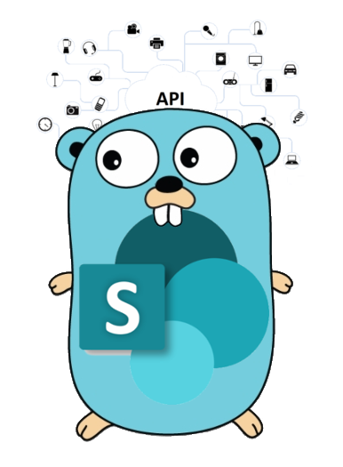

# gosip - SharePoint Auth & HTTP client for Go (Golang)


[](https://goreportcard.com/report/github.com/koltyakov/gosip)
[](https://godoc.org/github.com/koltyakov/gosip)
[](https://github.com/koltyakov/gosip/blob/master/LICENSE)
[](https://app.fossa.io/projects/git%2Bgithub.com%2Fkoltyakov%2Fgosip?ref=badge_shield)
[](https://sourcegraph.com/github.com/koltyakov/gosip?badge)

<p align="center">
  
</p>

## Main features

`gosip` allows you to perform SharePoint unattended (without user interaction) http authentication with Go (Golang) using different authentication strategies.

Simplifies SharePoint API consumption such as REST API, CSOM (client.svc/ProcessQuery), etc.

### Supported SharePoint versions:

- SharePoint Online (SPO)
- On-Premises (2019/2016/2013)

### Authentication strategies:

- SharePoint On-Premises 2019/2016/2013:
  - User credentianls (NTLM)
  - ADFS user credentials (ADFS, WAP -> Basic/NTLM, WAP -> ADFS)
  - Behind a reverse proxy (Forefront TMG, WAP -> Basic/NTLM, WAP -> ADFS)
  - Form-based authentication (FBA)
- SharePoint Online:
  - SAML based with user credentials
  - Add-In only permissions
  - ADFS user credentials (automatically detects in SAML strategy)

## Installation

```bash
go get github.com/koltyakov/gosip
```

## Usage insights

1\. Understand SharePoint environment type and authentication strategy.

Let's assume it's, SharePoint Online and Add-In Only permissions. Then `strategy "github.com/koltyakov/gosip/auth/addin"` subpackage should be used.

```golang
package main

import (
	"github.com/koltyakov/gosip"
	strategy "github.com/koltyakov/gosip/auth/addin"
)
```

2\. Initiate authentication object.

```golang
auth := &strategy.AuthCnfg{
	SiteURL:      os.Getenv("SPAUTH_SITEURL"),
	ClientID:     os.Getenv("SPAUTH_CLIENTID"),
	ClientSecret: os.Getenv("SPAUTH_CLIENTSECRET"),
}
```

AuthCnfg's from different strategies contains different options.

The authentication options can be provided explicitly or can be read from a configuration file.

```golang
configPath := "./config/private.adfs.json"
auth := &strategy.AuthCnfg{}

err := auth.ReadConfig(configPath)
if err != nil {
	fmt.Printf("Unable to get config: %v\n", err)
	return
}
```

3\. Use SP awared HTTP client from `github.com/koltyakov/gosip` package.

```golang
client := &gosip.SPClient{
	AuthCnfg: auth,
}

var req *http.Request
// Initiate API request
// ...

resp, err := client.Execute(req)
if err != nil {
	fmt.Printf("Unable to request api: %v", err)
	return
}
```

SPClient has `Execute` method which is a wrapper function injecting SharePoint authentication and ending up calling http.Client's `Do` method.

## Usage samples

### Addin Only Permissions

```golang
package main

import (
	"fmt"
	"io/ioutil"
	"log"
	"net/http"
	"os"

	"github.com/koltyakov/gosip"
	strategy "github.com/koltyakov/gosip/auth/addin"
)

func main() {
	auth := &strategy.AuthCnfg{
		SiteURL:      os.Getenv("SPAUTH_SITEURL"),
		ClientID:     os.Getenv("SPAUTH_CLIENTID"),
		ClientSecret: os.Getenv("SPAUTH_CLIENTSECRET"),
	}

	client := &gosip.SPClient{
		AuthCnfg: auth,
	}

	endpoint := auth.GetSiteURL() + "/_api/web?$select=Title"
	req, err := http.NewRequest("GET", endpoint, nil)
	if err != nil {
		log.Fatalf("unable to create a request: %v\n", err)
	}

	req.Header.Set("Accept", "application/json;odata=minimalmetadata")

	resp, err := client.Execute(req)
	if err != nil {
		log.Fatalf("unable to request api: %v\n", err)
	}
	defer resp.Body.Close()

	data, err := ioutil.ReadAll(resp.Body)
	if err != nil {
		log.Fatalf("unable to read a response: %v\n", err)
	}

	// No JSON unmarshalling for simplicity
	fmt.Printf("response: %s\n", data)
}
```

### ADFS with config reader

```golang
package main

import (
	"fmt"
	"io/ioutil"
	"log"
	"net/http"

	"github.com/koltyakov/gosip"
	strategy "github.com/koltyakov/gosip/auth/adfs"
)

func main() {
	configPath := "./config/private.adfs.json"
	auth := &strategy.AuthCnfg{}

	err := auth.ReadConfig(configPath)
	if err != nil {
		log.Fatalf("unable to get config: %v\n", err)
	}

	client := &gosip.SPClient{
		AuthCnfg: auth,
	}

	endpoint := auth.GetSiteURL() + "/_api/web?$select=Title"
	req, err := http.NewRequest("GET", endpoint, nil)
	if err != nil {
		log.Fatalf("unable to create a request: %v\n", err)
	}

	req.Header.Set("Accept", "application/json;odata=verbose")

	resp, err := client.Execute(req)
	if err != nil {
		log.Fatalf("unable to request api: %v\n", err)
	}
	defer resp.Body.Close()

	data, err := ioutil.ReadAll(resp.Body)
	if err != nil {
		log.Fatalf("unable to read a response: %v\n", err)
	}

	fmt.Printf("response: %s\n", data)
}
```

### Basic/NTLM auth

```golang
package main

import (
	"fmt"
	"io/ioutil"
	"log"
	"net/http"

	"github.com/koltyakov/gosip"
	strategy "github.com/koltyakov/gosip/auth/ntlm"
)

func main() {
	configPath := "./config/private.ntlm.json"
	auth := &strategy.AuthCnfg{}

	if err := auth.ReadConfig(configPath); err != nil {
		log.Fatalf("unable to get config: %v\n", err)
	}

	client := &gosip.SPClient{
		AuthCnfg: auth,
	}

	endpoint := auth.GetSiteURL() + "/_api/web?$select=Title"
	req, err := http.NewRequest("GET", endpoint, nil)
	if err != nil {
		log.Fatalf("unable to create a request: %v", err)
	}

	req.Header.Set("Accept", "application/json;odata=verbose")

	resp, err := client.Execute(req)
	if err != nil {
		log.Fatalf("unable to request api: %v\n", err)
	}
	defer resp.Body.Close()

	data, err := ioutil.ReadAll(resp.Body)
	if err != nil {
		log.Fatalf("unable to read a response: %v\n", err)
	}

	fmt.Printf("response: %s\n", data)
}
```

### SPRest helper

Provides generic GET/POST helpers for REST operations, reducing amount of `http.NewRequest` scaffolded code.

```golang
package main

import (
	"fmt"
	"io/ioutil"
	"log"
	"net/http"

	"github.com/koltyakov/gosip"
	"github.com/koltyakov/gosip/sprest"
	strategy "github.com/koltyakov/gosip/auth/ntlm"
)

func main() {
	configPath := "./config/private.ntlm.json"
	auth := &strategy.AuthCnfg{}

	if err := auth.ReadConfig(configPath); err != nil {
		log.Fatalf("unable to get config: %v\n", err)
	}

	sp := &sprest.HTTPClient{
		SPClient: &gosip.SPClient{
			AuthCnfg: auth,
		},
	}

	endpoint := auth.GetSiteURL() + "/_api/web?$select=Title"

	data, err := sp.Get(endpoint, nil)
	if err != nil {
		log.Fatalf("%v\n", err)
	}

	// sp.Post(endpoint, []byte(body), nil) // generic POST
	// sp.Delete(endpoint, nil) // generic DELETE helper crafts "X-Http-Method"="DELETE" header
	// sp.Update(endpoint, nil) // generic UPDATE helper crafts "X-Http-Method"="MERGE" header

	fmt.Printf("response: %s\n", data)
}
```

## Tests

### Run automated tests

Create auth credentials store files in `./config` folder for corresponding strategies:

- private.onprem-adfs.json
- private.onprem-fba.json
- private.onprem-ntlm.json
- private.onprem-tmg.json
- private.onprem-wap-adfs.json
- private.onprem-wap.json
- private.spo-addin.json
- private.spo-user.json
- private.spo-adfs.json

Auth configs should have the same structure as [node-sp-auth's](https://github.com/s-kainet/node-sp-auth) configs. See [samples](./config/samples).

```bash
go test ./... -v -race -count=1
```

Not provided auth configs are ignored and not skipped in tests.

### Run manual test

Modify `cmd/gosip/main.go` to include required scenarios and run:

```bash
go run cmd/gosip/main.go
```

### Run CI tests

Configure environment variables:

- SPAUTH_SITEURL
- SPAUTH_CLIENTID
- SPAUTH_CLIENTSECRET
- SPAUTH_USERNAME
- SPAUTH_PASSWORD

```bash
go test ./... -race -timeout 30s
```

## Reference

A lot of stuff for auth flows have been "copied" from [node-sp-auth](https://github.com/s-kainet/node-sp-auth) library (used as blueprint), which we intensively use in Node.js ecosystem for years.

## License

[](https://app.fossa.io/projects/git%2Bgithub.com%2Fkoltyakov%2Fgosip?ref=badge_large)
