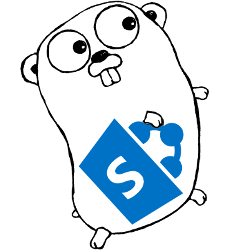

# gosip - SharePoint API HTTP client for Golang

<p align="center">
  
</p>

> This is early draft version. Lot's of improvements and breaking changes are expected in the near future until GA version is proclaimed.

Don't through bananas at me, it's my first steps and experiments in Golang field. =)

## Main features

`gosip` allows you to perform SharePoint unattended (without user interaction) http authentication with Go (Golang) using different authentication strategies.

Supported SharePoint versions:

- SharePoint Online (SPO)
- On-Prem: 2019, 2016, and 2013

Authentication strategies:

- SharePoint 2013, 2016, 2019:
  - ADFS user credentials
  - Form-based authentication (FBA)
  - Forefront TMG authentication
- SharePoint Online:
  - Addin only permissions
  - SAML based with user credentials
  - ADFS user credentials

## Installation

```bash
go get github.com/koltyakov/gosip
```

## Usage samples

### Addin Only Permissions

```golang
package main

import (
	"encoding/json"
	"fmt"
	"io/ioutil"
	"net/http"
	"os"

	"github.com/koltyakov/gosip"
	"github.com/koltyakov/gosip/auth/addin"
)

func main() {
	auth := &addin.AuthCnfg{
		SiteURL:      os.Getenv("SPAUTH_SITEURL"),
		ClientID:     os.Getenv("SPAUTH_CLIENTID"),
		ClientSecret: os.Getenv("SPAUTH_CLIENTSECRET"),
	}

	client := &gosip.SPClient{
		AuthCnfg: auth,
	}

	apiEndpoint := auth.GetSiteURL() + "/_api/web?$select=Title"
	req, err := http.NewRequest("GET", apiEndpoint, nil)
	if err != nil {
		fmt.Printf("Unable to create a request: %v", err)
		return
	}

	req.Header.Set("Accept", "application/json;odata=minimalmetadata")

	resp, err := client.Execute(req)
	if err != nil {
		fmt.Printf("Unable to request api: %v", err)
		return
	}
	defer resp.Body.Close()

	data, err := ioutil.ReadAll(resp.Body)
	if err != nil {
		fmt.Printf("Unable to read a response: %v", err)
		return
	}

	type apiResponse struct {
		Title string `json:"Title"`
	}

	results := &apiResponse{}

	err = json.Unmarshal(data, &results)
	if err != nil {
		fmt.Printf("Unable to parse a response: %v", err)
		return
	}

	fmt.Printf("Web title: %v\n", results.Title)
}
```

### ADFS with config reader

```golang
package main

import (
	"fmt"
	"io/ioutil"
	"net/http"

	"github.com/koltyakov/gosip"
	"github.com/koltyakov/gosip/auth/adfs"
)

func main() {
	configPath := "./config/private.adfs.json"
	auth := &adfs.AuthCnfg{}

	err := auth.ReadConfig(configPath)
	if err != nil {
		fmt.Printf("Unable to get config: %v\n", err)
		return
	}

	client := &gosip.SPClient{
		AuthCnfg: auth,
	}

	apiEndpoint := auth.GetSiteURL() + "/_api/web?$select=Title"
	req, err := http.NewRequest("GET", apiEndpoint, nil)
	if err != nil {
		fmt.Printf("Unable to create a request: %v", err)
		return
	}

	req.Header.Set("Accept", "application/json;odata=verbose")

	fmt.Printf("Requesting api endpoint: %s\n", apiEndpoint)
	resp, err := client.Execute(req)
	if err != nil {
		fmt.Printf("Unable to request api: %v\n", err)
		return
	}
	defer resp.Body.Close()

	data, err := ioutil.ReadAll(resp.Body)
	if err != nil {
		fmt.Printf("Unable to read a response: %v\n", err)
		return
	}

	fmt.Printf("Raw data: %s", string(data))
}
```

### Basic auth (NTML)

```golang
package main

import (
	"fmt"
	"io/ioutil"
	"net/http"

	"github.com/koltyakov/gosip"
	"github.com/koltyakov/gosip/auth/basic"
)

func main() {
	configPath := "./config/private.basic.json"
	auth := &basic.AuthCnfg{}

	err := auth.ReadConfig(configPath)
	if err != nil {
		fmt.Printf("Unable to get config: %v\n", err)
		return
	}

	client := &gosip.SPClient{
		AuthCnfg: auth,
	}

	apiEndpoint := auth.GetSiteURL() + "/_api/web?$select=Title"
	req, err := http.NewRequest("GET", apiEndpoint, nil)
	if err != nil {
		fmt.Printf("Unable to create a request: %v", err)
		return
	}

	req.Header.Set("Accept", "application/json;odata=verbose")

	fmt.Printf("Requesting api endpoint: %s\n", apiEndpoint)
	resp, err := client.Execute(req)
	if err != nil {
		fmt.Printf("Unable to request api: %v\n", err)
		return
	}
	defer resp.Body.Close()

	data, err := ioutil.ReadAll(resp.Body)
	if err != nil {
		fmt.Printf("Unable to read a response: %v\n", err)
		return
	}

	fmt.Printf("Raw data: %s", string(data))
}
```

## Tests

### Run automated tests

Create auth credentials store files in `./config` folder for corresponding strategies:

- private.addin.json
- private.adfs.json
- private.basic.json
- private.fba.json
- private.saml.json
- private.tmg.json

Auth configs should have the same structure as [node-sp-auth's](https://github.com/s-kainet/node-sp-auth) configs.

```bash
go test ./...
```

### Run manual test

Modify `cmd/gosip/main.go` to include required scenarios and run:

```bash
go run cmd/gosip/main.go
```

## Reference

A lot of stuff for authemtication flows have been "copied" from [node-sp-auth](https://github.com/s-kainet/node-sp-auth) library, which we intensively use in Node.js ecosystem for years.